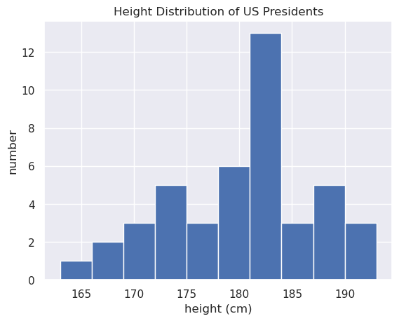
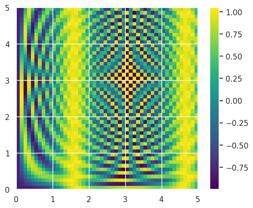
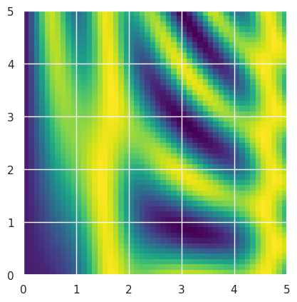

# Introduction to NumPy


```python
import numpy as np 
```

# Creating Arrays

>From python lists


```python
np.array([1, 5, 4, 9])
```


    array([1, 5, 4, 9])


> Explicitly set datatype


```python
np.array([1, 5, 4, 9], dtype='float32')
```


    array([1., 5., 4., 9.], dtype=float32)


> Multidimensional from list of lists


```python
np.array([range(i, i+3) for i in [2, 4, 6]])
```


    array([[2, 3, 4],
           [4, 5, 6],
           [6, 7, 8]])


> Arrays of zeros and ones, or constant


```python
np.zeros(10)
```


    array([0., 0., 0., 0., 0., 0., 0., 0., 0., 0.])


```python
np.zeros(10, dtype=int)
```


    array([0, 0, 0, 0, 0, 0, 0, 0, 0, 0])


```python
np.ones((3,5))
```


    array([[1., 1., 1., 1., 1.],
           [1., 1., 1., 1., 1.],
           [1., 1., 1., 1., 1.]])


```python
np.ones((3,4), dtype=int)
```


    array([[1, 1, 1, 1],
           [1, 1, 1, 1],
           [1, 1, 1, 1]])


> Fill with arbitrary number


```python
np.full((3,3), 3.14)
```


    array([[3.14, 3.14, 3.14],
           [3.14, 3.14, 3.14],
           [3.14, 3.14, 3.14]])


> Linear sequence


```python
np.arange(0, 20, 2)
```


    array([ 0,  2,  4,  6,  8, 10, 12, 14, 16, 18])


```python
np.linspace(0, 1, 5)
```


    array([0.  , 0.25, 0.5 , 0.75, 1.  ])


# NumPy Array Attributes


```python
np.random.seed(0)

x1 = np.random.randint(10, size=6)
x2 = np.random.randint(10, size=(3,4))
x3 = np.random.randint(10, size=(3,4,5))
```


```python
x3
```


    array([[[8, 1, 5, 9, 8],
            [9, 4, 3, 0, 3],
            [5, 0, 2, 3, 8],
            [1, 3, 3, 3, 7]],
    
           [[0, 1, 9, 9, 0],
            [4, 7, 3, 2, 7],
            [2, 0, 0, 4, 5],
            [5, 6, 8, 4, 1]],
    
           [[4, 9, 8, 1, 1],
            [7, 9, 9, 3, 6],
            [7, 2, 0, 3, 5],
            [9, 4, 4, 6, 4]]])


```python
x1
```


    array([5, 0, 3, 3, 7, 9])


```python
x2
```


    array([[3, 5, 2, 4],
           [7, 6, 8, 8],
           [1, 6, 7, 7]])


```python
for (index, array) in enumerate([x1,x2,x3]):
    print(f"x{index}")
    print(f"\t ndim: {array.ndim}")
    print(f"\t shape: {array.shape}")
    print(f"\t size: {array.size}")
    print(f"\t dtype: {array.dtype}")
    print(f"\t item size: {array.itemsize}")
    print(f"\t total size: {array.nbytes}")
```

    x0
    	 ndim: 1
    	 shape: (6,)
    	 size: 6
    	 dtype: int64
    	 item size: 8
    	 total size: 48
    x1
    	 ndim: 2
    	 shape: (3, 4)
    	 size: 12
    	 dtype: int64
    	 item size: 8
    	 total size: 96
    x2
    	 ndim: 3
    	 shape: (3, 4, 5)
    	 size: 60
    	 dtype: int64
    	 item size: 8
    	 total size: 480


# Indexing Arrays


```python
x1
```


    array([5, 0, 3, 3, 7, 9])


```python
x1[0], x1[-1]
```


    (5, 9)


```python
x2
```


    array([[3, 5, 2, 4],
           [7, 6, 8, 8],
           [1, 6, 7, 7]])


```python
x2[2,1], x2[-1,-4]
```


    (6, 1)


```python
x2[2,1]
```


    6


```python
x2[-1,-1] = 9
```


```python
x2
```


    array([[3, 5, 2, 4],
           [7, 6, 8, 8],
           [1, 6, 7, 9]])


>[!attention] NumPy arrays are fixed type so conversion may be necessary

# Slicing arrays

>[!warning] Slices are views, so you may or may not want to `.copy()`

>Basic syntax
>`x[start:stop:step]`


```python
x = np.arange(10)
```


```python
x[:5], x[5:], x[2:4]
```


    (array([0, 1, 2, 3, 4]), array([5, 6, 7, 8, 9]), array([2, 3]))


```python
x[::2], x[3::2]
```


    (array([0, 2, 4, 6, 8]), array([3, 5, 7, 9]))


```python
x[::-2], x[-5::-2], x[-5::2]
```


    (array([9, 7, 5, 3, 1]), array([5, 3, 1]), array([5, 7, 9]))


>Reverse an array


```python
x[::-1]
```


    array([9, 8, 7, 6, 5, 4, 3, 2, 1, 0])


```python
x4 = np.random.randint(10, size=(4,4))
```


```python
x4
```


    array([[2, 0, 3, 2],
           [0, 7, 5, 9],
           [0, 2, 7, 2],
           [9, 2, 3, 3]])


```python
x4[::-1], x4[:,::-1], x4[::-1,::-1]
```


    (array([[9, 2, 3, 3],
            [0, 2, 7, 2],
            [0, 7, 5, 9],
            [2, 0, 3, 2]]),
     array([[2, 3, 0, 2],
            [9, 5, 7, 0],
            [2, 7, 2, 0],
            [3, 3, 2, 9]]),
     array([[3, 3, 2, 9],
            [2, 7, 2, 0],
            [9, 5, 7, 0],
            [2, 3, 0, 2]]))


```python
x4.T
```


    array([[2, 0, 0, 9],
           [0, 7, 2, 2],
           [3, 5, 7, 3],
           [2, 9, 2, 3]])


```python
x4
```


    array([[2, 0, 3, 2],
           [0, 7, 5, 9],
           [0, 2, 7, 2],
           [9, 2, 3, 3]])


```python
x4[0], x4[0,:], x4[:,0]
```


    (array([2, 0, 3, 2]), array([2, 0, 3, 2]), array([2, 0, 0, 9]))


# Reshaping Arrays


```python
x2 = np.random.randint(10,size=(3,4))
x2
```


    array([[9, 1, 4, 6],
           [8, 2, 3, 0],
           [0, 6, 0, 6]])


```python
x2.reshape(4,3)
```


    array([[9, 1, 4],
           [6, 8, 2],
           [3, 0, 0],
           [6, 0, 6]])


```python
grid = np.arange(1, 10).reshape((3,3))
grid
```


    array([[1, 2, 3],
           [4, 5, 6],
           [7, 8, 9]])


>Array to row vector


```python
x = np.array([1,2,3])
x
```


    array([1, 2, 3])


```python
x.reshape((1,3))
```


    array([[1, 2, 3]])


```python
x[np.newaxis, :]
```


    array([[1, 2, 3]])


>Array to column vector


```python
x.reshape((3,1))
```


    array([[1],
           [2],
           [3]])


```python
x[:, np.newaxis]
```


    array([[1],
           [2],
           [3]])


# Array Concatenation and Splitting


```python
x = np.array([1,2,3])
y = np.array([3,2,1])
```


```python
np.concatenate([x,y])
```


    array([1, 2, 3, 3, 2, 1])


```python
np.concatenate([x,y,x])
```


    array([1, 2, 3, 3, 2, 1, 1, 2, 3])


```python
np.array([x,y])
```


    array([[1, 2, 3],
           [3, 2, 1]])


```python
grid = np.array([[1,2,3],[4,5,6]])
grid
```


    array([[1, 2, 3],
           [4, 5, 6]])


```python
np.concatenate([grid, grid])
```


    array([[1, 2, 3],
           [4, 5, 6],
           [1, 2, 3],
           [4, 5, 6]])


```python
np.concatenate([grid,grid], axis=1)
```


    array([[1, 2, 3, 1, 2, 3],
           [4, 5, 6, 4, 5, 6]])


>`vstack` and `hstack`


```python
x = np.array([1,2,3])
grid = np.array([[9,8,7],
                 [6,5,4]])
```


```python
np.vstack([x, grid])
```


    array([[1, 2, 3],
           [9, 8, 7],
           [6, 5, 4]])


```python
y = np.array([[99],[99]])
y
```


    array([[99],
           [99]])


```python
np.hstack([grid, y])
```


    array([[ 9,  8,  7, 99],
           [ 6,  5,  4, 99]])


>Splitting arrays


```python
x = [1, 2, 3, 99, 99, 3, 2, 1]
grid = np.arange(16).reshape((4,4))
grid
```


    array([[ 0,  1,  2,  3],
           [ 4,  5,  6,  7],
           [ 8,  9, 10, 11],
           [12, 13, 14, 15]])


```python
x1, x2, x3 = np.split(x, [3,5])
print(x, x1, x2, x3)
```

    [1, 2, 3, 99, 99, 3, 2, 1] [1 2 3] [99 99] [3 2 1]


```python
upper, lower = np.vsplit(grid, [2])
print(f"Upper:\n {upper}")
print(f"Lower:\n {lower}")
```

    Upper:
     [[0 1 2 3]
     [4 5 6 7]]
    Lower:
     [[ 8  9 10 11]
     [12 13 14 15]]


```python
left, right = np.hsplit(grid, [2])
print(f"Left:\n{left}")
print(f"Right:\n{right}")
```

    Left:
    [[ 0  1]
     [ 4  5]
     [ 8  9]
     [12 13]]
    Right:
    [[ 2  3]
     [ 6  7]
     [10 11]
     [14 15]]


# Array computation: Universal Functions


```python
import numpy as np 
np.random.seed(0)
```

>Slow calculations with regular CPython


```python
def compute_reciprocals(values): 
    output = np.empty(len(values))
    for i in range(len(values)):
        output[i] = 1.0 / values[i]
    return output

values = np.random.randint(1, 10, size=5)
compute_reciprocals(values)
```


    array([0.16666667, 1.        , 0.25      , 0.25      , 0.125     ])


```python
big_array = np.random.randint(1, 100, size=int(1e6))
%timeit compute_reciprocals(big_array)
```

    1.2 s ± 17.9 ms per loop (mean ± std. dev. of 7 runs, 1 loop each)


```python
print(compute_reciprocals(values))
print(1.0 / values)
```

    [0.16666667 1.         0.25       0.25       0.125     ]
    [0.16666667 1.         0.25       0.25       0.125     ]


```python
%timeit (1.0 / big_array)
```

    1.05 ms ± 15.3 μs per loop (mean ± std. dev. of 7 runs, 1,000 loops each)


```python
np.arange(5) / np.arange(1, 6)
```


    array([0.        , 0.5       , 0.66666667, 0.75      , 0.8       ])


```python
x = np.arange(9).reshape((3,3))
2 ** x
```


    array([[  1,   2,   4],
           [  8,  16,  32],
           [ 64, 128, 256]])


>Arithmetic
>
>These are equivalent to, eg. `np.add()` or `np.divide()`


```python
x = np.arange(4)
print(f"x + 5 \t= {x + 5}")
print(f"x - 5 \t= {x - 5}")
print(f"x * 2 \t= {x * 2}")
print(f"x / 2 \t= {x / 2}")
print(f"x // 2 \t= {x // 2}")
print(f"x ** 2 \t= {x ** 2}")
print(f"x % 2 \t= {x % 2}")
```

    x + 5 	= [5 6 7 8]
    x - 5 	= [-5 -4 -3 -2]
    x * 2 	= [0 2 4 6]
    x / 2 	= [0.  0.5 1.  1.5]
    x // 2 	= [0 0 1 1]
    x ** 2 	= [0 1 4 9]
    x % 2 	= [0 1 0 1]


```python
x - 5
```


    array([-5, -4, -3, -2])


```python
-(0.5*x + 1) **2
```


    array([-1.  , -2.25, -4.  , -6.25])


>Absolute value
>can use `abs()` or `np.absolute()`, with an alias of `np.abs()`


```python
x = np.array([-2, -1, 0, 1, 2])
abs(x)
```


    array([2, 1, 0, 1, 2])


```python
np.abs(x)
```


    array([2, 1, 0, 1, 2])


```python
np.absolute(x)
```


    array([2, 1, 0, 1, 2])


> Absolute value of complex numbers returns magintude


```python
x = np.array([3 - 4j, 4 - 3j, 2 + 0j, 0 + 1j])
x
```


    array([3.-4.j, 4.-3.j, 2.+0.j, 0.+1.j])


```python
np.abs(x)
```


    array([5., 5., 2., 1.])


>Trigonometry


```python
theta = np.linspace(0, np.pi, 3)
theta
```


    array([0.        , 1.57079633, 3.14159265])


```python
np.sin(theta), np.cos(theta), np.tan(theta)
```


    (array([0.0000000e+00, 1.0000000e+00, 1.2246468e-16]),
     array([ 1.000000e+00,  6.123234e-17, -1.000000e+00]),
     array([ 0.00000000e+00,  1.63312394e+16, -1.22464680e-16]))


```python
x = [-1, 0, 1]
np.arcsin(x), np.arccos(x), np.arctan(x)
```


    (array([-1.57079633,  0.        ,  1.57079633]),
     array([3.14159265, 1.57079633, 0.        ]),
     array([-0.78539816,  0.        ,  0.78539816]))


>Exponents and Logs


```python
x = [1,2,3]
print(f"e^x:\t{np.exp(x)}")
print(f"2^x:\t{np.exp2(x)}")
print(f"3^x:\t{np.power(3, x)}")
```

    e^x:	[ 2.71828183  7.3890561  20.08553692]
    2^x:	[2. 4. 8.]
    3^x:	[ 3  9 27]


```python
x = [1, 2, 4, 10]
print(f"ln(x):\t{np.log(x)}")
print(f"log2(x):\t{np.log2(x)}")
print(f"log10(x):\t{np.log10(x)}")
```

    ln(x):	[0.         0.69314718 1.38629436 2.30258509]
    log2(x):	[0.         1.         2.         3.32192809]
    log10(x):	[0.         0.30103    0.60205999 1.        ]


>[!attention]
>For maintaining precision with very small input, instead use:


```python
x = [0, 0.001, 0.01, 0.1, 1e-10]
print(f"exp(x) - 1 = {np.expm1(x)}")
print(f"log(1 + x) = {np.log1p(x)}")
```

    exp(x) - 1 = [0.00000000e+00 1.00050017e-03 1.00501671e-02 1.05170918e-01
     1.00000000e-10]
    log(1 + x) = [0.00000000e+00 9.99500333e-04 9.95033085e-03 9.53101798e-02
     1.00000000e-10]


>Specialized ufuncs with `scipy`


```python
from scipy import special
```


```python
x = [1, 5, 10]
```

>Gamma functions


```python
print("gamma(x)     =", special.gamma(x))
print("ln|gamma(x)| =", special.gammaln(x))
print("beta(x, 2)   =", special.beta(x, 2))
```

    gamma(x)     = [1.0000e+00 2.4000e+01 3.6288e+05]
    ln|gamma(x)| = [ 0.          3.17805383 12.80182748]
    beta(x, 2)   = [0.5        0.03333333 0.00909091]


> Error function (integral of Gaussian), its complement and inverse


```python
x = np.array([0, 0.3, 0.7, 1.0])
print("erf(x)  =", special.erf(x))
print("erfc(x) =", special.erfc(x))
print("erfinv(x) =", special.erfinv(x))
```

    erf(x)  = [0.         0.32862676 0.67780119 0.84270079]
    erfc(x) = [1.         0.67137324 0.32219881 0.15729921]
    erfinv(x) = [0.         0.27246271 0.73286908        inf]


>Aggregation: reduce and accumulate


```python
x = np.arange(1,6)
```


```python
np.add.reduce(x) # same as `np.sum()`
```


    15


```python
np.multiply.reduce(x) # same as `np.prod()`
```


    120


```python
np.add.accumulate(x) # same as `np.cumsum()`
```


    array([ 1,  3,  6, 10, 15])


```python
np.multiply.accumulate(x) # same as `np.cumprod`
```


    array([  1,   2,   6,  24, 120])


>__Specifying pre-existing output array__
>
>for large calculations, avoids creation of a temporary array with a subsequent copy into y


```python
x = np.arange(5)
y = np.empty(5)
np.multiply(x, 10, out=y)
print(y)
```

    [ 0. 10. 20. 30. 40.]


```python
y = np.zeros(10)
np.power(2, x, out=y[::2])
print(y)
```

    [ 1.  0.  2.  0.  4.  0.  8.  0. 16.  0.]


>Perform calculations on pairs with `outer`


```python
x = np.arange(1, 6)
np.multiply(x,x)
```


    array([ 1,  4,  9, 16, 25])


```python
np.multiply.outer(x,x)
```


    array([[ 1,  2,  3,  4,  5],
           [ 2,  4,  6,  8, 10],
           [ 3,  6,  9, 12, 15],
           [ 4,  8, 12, 16, 20],
           [ 5, 10, 15, 20, 25]])


```python
np.add.outer(x,x)
```


    array([[ 2,  3,  4,  5,  6],
           [ 3,  4,  5,  6,  7],
           [ 4,  5,  6,  7,  8],
           [ 5,  6,  7,  8,  9],
           [ 6,  7,  8,  9, 10]])


# Statistical Aggregation


```python
import numpy as np 
L = np.random.random(100)
```

>Summing


```python
np.sum(L)
```


    49.210421685435314


```python
big_array = np.random.rand(int(1e6))
%timeit sum(big_array)
%timeit np.sum(big_array)
```

    57.2 ms ± 1.13 ms per loop (mean ± std. dev. of 7 runs, 10 loops each)
    245 μs ± 19.7 μs per loop (mean ± std. dev. of 7 runs, 1,000 loops each)


>Minimum and Maximum


```python
np.min(big_array), np.max(big_array)
```


    (2.067514368597756e-07, 0.9999992772471815)


```python
%timeit min(big_array)
%timeit np.min(big_array)
```

    41.4 ms ± 621 μs per loop (mean ± std. dev. of 7 runs, 10 loops each)
    167 μs ± 1.87 μs per loop (mean ± std. dev. of 7 runs, 10,000 loops each)


>Alternate syntax


```python
big_array.sum(), big_array.max()
```


    (499859.51691425196, 0.9999992772471815)


>Multidemensional aggregates

| Function Name | NaN-safe Version | Description                               |     |
| ------------- | ---------------- | ----------------------------------------- | --- |
| np.sum        | np.nansum        | Compute sum of elements                   |     |
| np.prod       | np.nanprod       | Compute product of elements               |     |
| np.mean       | np.nanmean       | Compute median of elements                |     |
| np.std        | np.nanstd        | Compute standard deviation                |     |
| np.var        | np.nanvar        | Compute variance                          |     |
| np.min        | np.nanmin        | Find minimum value                        |     |
| np.max        | np.nanmax        | Find maximum value                        |     |
| np.argmin     | np.nanargmin     | Find index of minimum value               |     |
| np.argmax     | np.nanargmax     | Find index of maximum value               |     |
| np.median     | np.nanmedian     | Compute median of elements                |     |
| np.percentile | np.nanpercentile | Compute rank-based statistics of elements |     |
| np.any        | N/A              | Evaluate whether any elements are true    |     |
| np.all        | N/A              | Evaluate whether all elements are true    |     |


```python
pwd
```


    '/home/biscotty/Learning/Python Data Science Handbook/docs'


```python
!head -4 ../src/notebooks/data/president_heights.csv
```

    order,name,height(cm)
    1,George Washington,189
    2,John Adams,170
    3,Thomas Jefferson,189


```python
import pandas as pd 
df = pd.read_csv("../src/notebooks/data/president_heights.csv")
heights = np.array(df["height(cm)"])
heights
```


    array([189, 170, 189, 163, 183, 171, 185, 168, 173, 183, 173, 173, 175,
           178, 183, 193, 178, 173, 174, 183, 183, 168, 170, 178, 182, 180,
           183, 178, 182, 188, 175, 179, 183, 193, 182, 183, 177, 185, 188,
           188, 182, 185, 191, 182])


```python
print("Mean height: \t", heights.mean())
print("Std. Dev.: \t", heights.std())
print("Max height: \t", heights.max())
print("Min height: \t", heights.min())
print("25th percentile:", np.percentile(heights, 25))
print("Median:  \t", np.median(heights))
print("75th percentile:", np.percentile(heights, 75))
```

    Mean height: 	 180.04545454545453
    Std. Dev.: 	 6.983599441335736
    Max height: 	 193
    Min height: 	 163
    25th percentile: 174.75
    Median:  	 182.0
    75th percentile: 183.5


```python
%matplotlib inline
import matplotlib.pyplot as plt 
import seaborn; seaborn.set()
```


```python
plt.hist(heights)
plt.title('Height Distribution of US Presidents')
plt.xlabel('height (cm)')
plt.ylabel('number');
```


    

    


# Array Computation: Broadcasting

Allows for performing binary operations on arrays of different sizes.


```python
import numpy as np 
a = np.array([0, 1, 2])
b = np.array([5, 5, 5])
a + b
```


    array([5, 6, 7])


> Add scalar to array


```python
a + 5
```


    array([5, 6, 7])


>Add 1D array to 2D array


```python
M = np.ones((3,3))
M
```


    array([[1., 1., 1.],
           [1., 1., 1.],
           [1., 1., 1.]])


```python
M+a
```


    array([[1., 2., 3.],
           [1., 2., 3.],
           [1., 2., 3.]])


>Adding a row vector and column vector


```python
a = np.arange(3)
b = np.arange(3)[:, np.newaxis]
a,b
```


    (array([0, 1, 2]),
     array([[0],
            [1],
            [2]]))


```python
a + b
```


    array([[0, 1, 2],
           [1, 2, 3],
           [2, 3, 4]])


>[!info] Broadcasting rules
>1. If the 2 arrays differ in number of dimensions, the one with fewer dimensions is padded with 1s on the leading (left) side
>2. If the shape does not match in any dimension, the one with shape=1 in that dimension is stretched to match the other
>3. If the sizes disagree and neither is 1, an error will result.


```python
M = np.ones((2,3))
a = np.arange(3)
M.shape, a.shape
```


    ((2, 3), (3,))


a will be padded with ones, so (1,3).


```python
M + a
```


    array([[1., 2., 3.],
           [1., 2., 3.]])


```python
M
```


    array([[1., 1., 1.],
           [1., 1., 1.]])


```python
a
```


    array([0, 1, 2])


```python
a = np.arange(3).reshape((3,1))
b = np.arange(3)
a,b
```


    (array([[0],
            [1],
            [2]]),
     array([0, 1, 2]))


```python
a+b
```


    array([[0, 1, 2],
           [1, 2, 3],
           [2, 3, 4]])


```python
M = np.ones((3,2))
a = np.arange(3)
M,a
```


    (array([[1., 1.],
            [1., 1.],
            [1., 1.]]),
     array([0, 1, 2]))


```python
# M+a -- error
```

>Centering an array
>
>Imagine 10 observations consisting of 3 values


```python
X = np.random.random((10, 3))
```

>Mean of features


```python
Xmean = X.mean(0)
Xmean
```


    array([0.50275272, 0.56773027, 0.67378511])


```python
X_centered = X - Xmean
X_centered.mean(0)
```


    array([-9.99200722e-17,  1.11022302e-17,  0.00000000e+00])


>Plotting 2 dimensional functions


```python
x = np.linspace(0, 5, 50)
y = np.linspace(0, 50, 50)[:, np.newaxis]
x.shape, y.shape
```


    ((50,), (50, 1))


```python
z = np.sin(x) ** 10 + np.cos(10 + y * x) * np.cos(x)
```


```python
z.shape
```


    (50, 50)


```python
%matplotlib inline 
import matplotlib.pyplot as plt 

plt.imshow(z, origin="lower", extent=[0, 5, 0, 5], 
          cmap='viridis')
plt.colorbar();
```


    

    


```python
x = np.linspace(0, 5, 50)
y = np.linspace(0, 5, 50)[:, np.newaxis]
z = np.sin(x) ** 10 + np.cos(10 + y * x) * np.cos(x)
plt.imshow(z, origin="lower", extent=[0,5,0,5], cmap='viridis')
```


    <matplotlib.image.AxesImage at 0x7faa49419220>


    

    


```python

```
