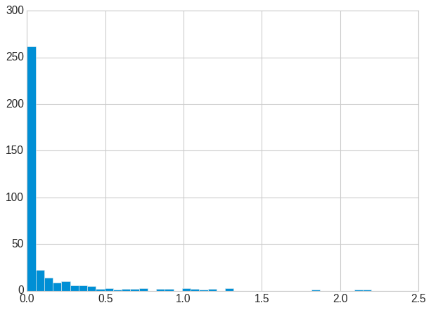
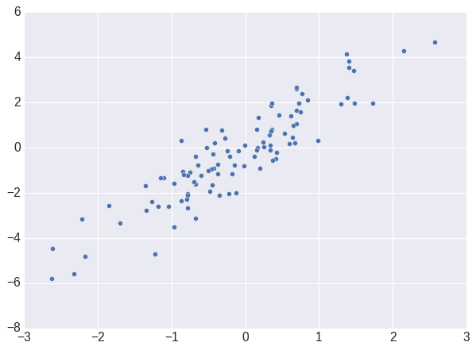
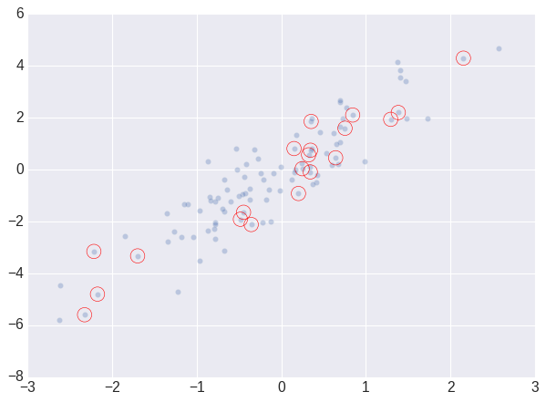
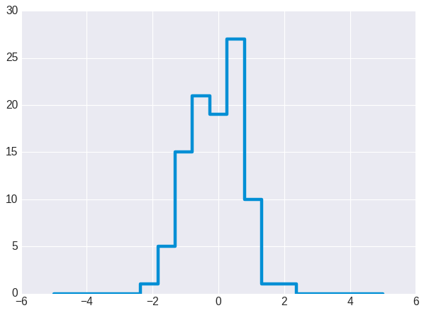
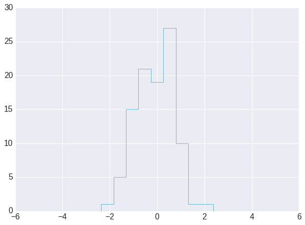
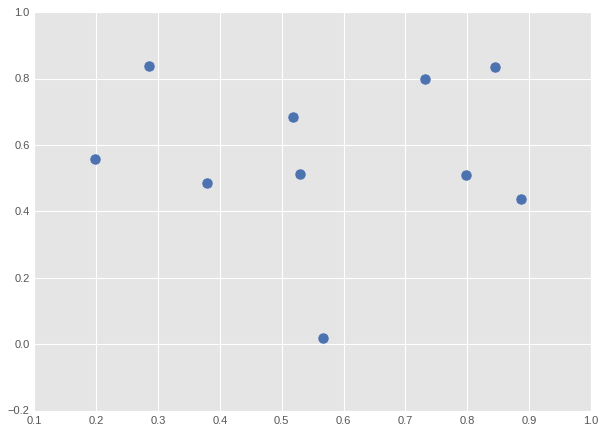
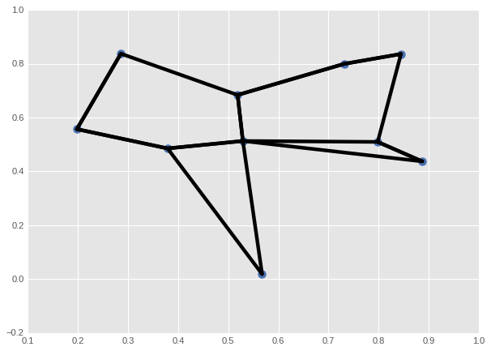

# Introduction to NumPy Pt 2


```python
import numpy as np 
```

# Comparisons, Masks and Boolean Logic


```python
import pandas as pd
from vega_datasets import data

```


```python
rainfall_mm = np.array(
    data.seattle_weather().set_index('date')['precipitation']['2015'])
inches = rainfall_mm / 25.4
inches.shape
```


    (365,)


```python
%matplotlib inline
import matplotlib.pyplot as plt
plt.style.use('seaborn-v0_8-whitegrid')

plt.hist(inches, 40);
```


    

    


# Comparison Operators as ufuncs


```python
x = np.array([1,2,3,4,5])
```


```python
x < 3
```


    array([ True,  True, False, False, False])


```python
x > 3
```


    array([False, False, False,  True,  True])


```python
x != 3
```


    array([ True,  True, False,  True,  True])


>Array comparisons with compound expressions


```python
(2 * x) == (x ** 2)
```


    array([False,  True, False, False, False])


>In 2 dimensions


```python
rng = np.random.default_rng(seed=1701)
x = rng.integers(10, size=(3, 4))
x
```


    array([[9, 4, 0, 3],
           [8, 6, 3, 1],
           [3, 7, 4, 0]])


```python
x < 6
```


    array([[False,  True,  True,  True],
           [False, False,  True,  True],
           [ True, False,  True,  True]])


# Working with Boolean Arrays


```python
print(x)
```

    [[9 4 0 3]
     [8 6 3 1]
     [3 7 4 0]]


>Counting entries


```python
np.count_nonzero(x < 6)
```


    8


```python
np.sum(x < 6)
```


    8


>Across rows and columns


```python
np.sum(x < 6, axis=0)
```


    array([1, 1, 3, 3])


```python
np.sum(x < 6, axis=1)
```


    array([3, 2, 3])


```python
np.any(x > 8)
```


    True


```python
np.all(x > 0)
```


    False


```python
np.all(x >= 0)
```


    True


```python
np.any(x > 7, axis=1)
```


    array([ True,  True, False])


## Boolean operators


```python
np.sum((inches > 0.5 ) & (inches < 1))
```


    13


```python
np.sum((rainfall_mm > 10) & (rainfall_mm < 20))
```


    16


```python
np.sum(~( (inches <= 0.5 ) | (inches >= 1 )))
```


    13


```python
print("Number of days without rain:\t", np.sum(inches == 0))
print("Number of days with rain:\t", np.sum(inches != 0))
print("Number of days > 0.5 inches:\t", np.sum(inches > 0.5))
print("Rainy days > 0.2 inches:\t", np.sum((inches > 0) & (inches < 0.2)))
```

    Number of days without rain:	 221
    Number of days with rain:	 144
    Number of days > 0.5 inches:	 27
    Rainy days > 0.2 inches:	 83


# Boolean arrays as masks


```python
x
```


    array([[9, 4, 0, 3],
           [8, 6, 3, 1],
           [3, 7, 4, 0]])


```python
x < 5
```


    array([[False,  True,  True,  True],
           [False, False,  True,  True],
           [ True, False,  True,  True]])


```python
x[x < 5]
```


    array([4, 0, 3, 3, 1, 3, 4, 0])


```python
rainy = (inches > 0)
summer = (np.arange(365) - 172 <90) & (np.arange(365) - 172 > 0)
```


```python
print("Median precip on rainy days", np.median(inches[rainy]))
print("Median precip on summer days", np.median(inches[summer]))
print("Maximum precip on summer days", np.max(inches[summer]))
print("Median precip on non-summer rainy days", np.median(inches[rainy & ~summer]))
```

    Median precip on rainy days 0.14960629921259844
    Median precip on summer days 0.0
    Maximum precip on summer days 1.2795275590551183
    Median precip on non-summer rainy days 0.16141732283464566


```python
(np.arange(10) - 2) > 5
```


    array([False, False, False, False, False, False, False, False,  True,
            True])


# Fancy Indexing


```python
import numpy as np 
rng = np.random.default_rng(seed=172)
x = rng.integers(100, size=10)
print(x)
```

    [33 17 74 92  6 58  7 30 22 47]


```python
[x[3], x[7], x[2]]
```


    [92, 30, 74]


```python
x[[3,7,4]]
```


    array([92, 30,  6])


```python
ind = [3,7,4]
x[ind]
```


    array([92, 30,  6])


>The array has the shape of the index


```python
ind = np.array([[3,7],
                [4,5]])
x[ind]
```


    array([[92, 30],
           [ 6, 58]])


>Multiple dimensions


```python
X = np.arange(12).reshape((3,4))
X
```


    array([[ 0,  1,  2,  3],
           [ 4,  5,  6,  7],
           [ 8,  9, 10, 11]])


```python
row = np.array([0,1,2])
col = np.array([2,1,3])
```


```python
X[row]
```


    array([[ 0,  1,  2,  3],
           [ 4,  5,  6,  7],
           [ 8,  9, 10, 11]])


```python
X[row,col]
```


    array([ 2,  5, 11])


```python
X[row[:, np.newaxis]]
```


    array([[[ 0,  1,  2,  3]],
    
           [[ 4,  5,  6,  7]],
    
           [[ 8,  9, 10, 11]]])


```python
X[row[:, np.newaxis], col]
```


    array([[ 2,  1,  3],
           [ 6,  5,  7],
           [10,  9, 11]])


```python
row[:, np.newaxis] * col
```


    array([[0, 0, 0],
           [2, 1, 3],
           [4, 2, 6]])


# Combined indexing


```python
X
```


    array([[ 0,  1,  2,  3],
           [ 4,  5,  6,  7],
           [ 8,  9, 10, 11]])


>Combine fancy and simple


```python
X[2, [2,0,3]]
```


    array([10,  8, 11])


>Combine fancy with slicing


```python
X[1:,[2, 0, 1]]
```


    array([[ 6,  4,  5],
           [10,  8,  9]])


>Combine fancy with masking


```python
mask = np.array([1,0,1,0], dtype=bool)
X[row[:, np.newaxis],mask]
```


    array([[ 0,  2],
           [ 4,  6],
           [ 8, 10]])


## Selecting random points


```python
mean = [0,0]
cov = [[1,2],
       [2,5]]
X = rng.multivariate_normal(mean, cov, 100)
X.shape
```


    (100, 2)


```python
%matplotlib inline
import matplotlib.pyplot as plt 
plt.style.use('seaborn-v0_8-darkgrid')
plt.scatter(X[:,0], X[:,1], s=30);
```


    

    


> select 20 random points


```python
indices = rng.choice(X.shape[0], 20, replace=False)
indices
```


    array([33, 39, 46, 16, 85,  2, 40, 37, 50, 95, 49, 56, 43, 81, 87, 30, 64,
           90, 12, 69])


```python
X[:5]
```


    array([[ 0.77221702,  2.38768489],
           [-0.96271152, -1.5854034 ],
           [ 0.32280088,  0.56388269],
           [-0.32083704,  0.77040957],
           [-0.78039237, -2.02900027]])


```python
X.shape
```


    (100, 2)


```python
selection = X[indices]
selection.shape
```


    (20, 2)


```python
plt.scatter(X[:,0], X[:,1], s=30, alpha=0.3)
plt.scatter(selection[:,0], selection[:,1], edgecolors='red', 
            facecolor='none', s=200);
```


    

    


# Modifying values with fancy indexing


```python
x = np.arange(10)
i = np.array([2,1,8,4])
x[i] = 99
x
```


    array([ 0, 99, 99,  3, 99,  5,  6,  7, 99,  9])


```python
x[i] -= 10
x
```


    array([ 0, 89, 89,  3, 89,  5,  6,  7, 89,  9])


```python
x = np.zeros(10)
x[[0,0]] = [4,6]
x
```


    array([6., 0., 0., 0., 0., 0., 0., 0., 0., 0.])


```python
x = np.zeros(10)
i = [2,3,3,4,4,4]
x[i] += 1
x
```


    array([0., 0., 1., 1., 1., 0., 0., 0., 0., 0.])


>`at` method


```python
x = np.zeros(10)
np.add.at(x, i, 1)
x
```


    array([0., 0., 1., 2., 3., 0., 0., 0., 0., 0.])


# Binning Data


```python
rng = np.random.default_rng(seed=42)
x = rng.normal(size=100)
```

Manually compute histogram


```python
# compute a histogram by hand
bins = np.linspace(-5, 5, 20)
counts = np.zeros_like(bins)

# find the appropriate bin for each x
i = np.searchsorted(bins, x)

# add 1 to each of these bins
np.add.at(counts, i, 1)
```


```python
plt.plot(bins, counts, drawstyle='steps');
```


    

    


```python
plt.hist(x, bins, histtype='step');
```


    

    


# Sorting Arrays

> Selection sort
>
> $O(N^2)$


```python
import numpy as np 

def selection_sort(x):
    for i in range(len(x)): 
        swap = i + np.argmin(x[i:])
        print(f"{i=}, {swap=}")
        (x[i], x[swap]) = (x[swap], x[i])
    return x
```


```python
x = np.array([2, 1, 4, 3, 5])
selection_sort(x)
```

    i=0, swap=1
    i=1, swap=1
    i=2, swap=3
    i=3, swap=3
    i=4, swap=4


    array([1, 2, 3, 4, 5])


>Bogosort
>
>Very inefficient based on random shuffling until the result happens to be sorted
>
>$O(N \times N!)$


```python
def bogosort(x):
    while np.any(x[:-1] > x[1:]):
        rng.shuffle(x)
    return x
```


```python
x = np.array([2,1,4,3,5])
bogosort(x)
```


    array([1, 2, 3, 4, 5])


>Fast sorting
>
>Default is $O(N \log N)$ quicksort
>
>Can choose heapsort or mergesort


```python
x = np.array([2,1,4,3,5])
print(np.sort(x))
print(x)
```

    [1 2 3 4 5]
    [2 1 4 3 5]


```python
x.sort()
```


```python
print(x)
```

    [1 2 3 4 5]


>argsort returns indices of sorted elements


```python
x = np.array([2,1,4,3,5])
i = np.argsort(x)
print(i)
print(x[i])
```

    [1 0 3 2 4]
    [1 2 3 4 5]


>Sorting along rows and colums


```python
rng = np.random.default_rng(seed=42)
X = rng.integers(0, 10, (4,6))
X
```


    array([[0, 7, 6, 4, 4, 8],
           [0, 6, 2, 0, 5, 9],
           [7, 7, 7, 7, 5, 1],
           [8, 4, 5, 3, 1, 9]])


```python
np.sort(X)
```


    array([[0, 4, 4, 6, 7, 8],
           [0, 0, 2, 5, 6, 9],
           [1, 5, 7, 7, 7, 7],
           [1, 3, 4, 5, 8, 9]])


```python
np.sort(X, axis=1)
```


    array([[0, 4, 4, 6, 7, 8],
           [0, 0, 2, 5, 6, 9],
           [1, 5, 7, 7, 7, 7],
           [1, 3, 4, 5, 8, 9]])


>Partial sorts: partitioning
>
>eg. $K$ smallest values rather than sorting the entire array
>takes the smallest K values and puts them at the beginning.
>
>Both sub-groups have arbitrary order


```python
x = np.array([7, 2, 9, 1, 6, 5, 4])
np.partition(x, 2)
```


    array([1, 2, 4, 7, 6, 5, 9])


```python
X
```


    array([[0, 7, 6, 4, 4, 8],
           [0, 6, 2, 0, 5, 9],
           [7, 7, 7, 7, 5, 1],
           [8, 4, 5, 3, 1, 9]])


```python
np.partition(X, 2, axis=0)
```


    array([[0, 4, 2, 0, 1, 1],
           [0, 6, 5, 3, 4, 8],
           [7, 7, 6, 4, 5, 9],
           [8, 7, 7, 7, 5, 9]])


```python
np.partition(X, 2, axis=1)
```


    array([[0, 4, 4, 7, 6, 8],
           [0, 0, 2, 6, 5, 9],
           [1, 5, 7, 7, 7, 7],
           [1, 3, 4, 5, 8, 9]])


# NumPy k-Nearest Neighbors


```python
rng = np.random.default_rng(seed=1072)
X = rng.random((10,2))
```


```python
%matplotlib inline
import matplotlib.pyplot as plt 
plt.style.use('ggplot')
plt.scatter(X[:,0], X[:,1], s=100);
```


    

    


>Compute the distance between the points


```python
dist_sq = np.sum((X[:, np.newaxis] - X[np.newaxis, :]) ** 2, axis=-1)
```


```python
differences = X[:, np.newaxis] - X[np.newaxis, :]
differences.shape
```


    (10, 10, 2)


```python
X
```


    array([[0.51875285, 0.68375989],
           [0.88710275, 0.43698164],
           [0.52925632, 0.51273057],
           [0.19807892, 0.55679665],
           [0.79818734, 0.50937835],
           [0.73140744, 0.79933684],
           [0.8446842 , 0.83604152],
           [0.37903383, 0.48513945],
           [0.28584196, 0.83724795],
           [0.56756174, 0.01828761]])


```python
X[:, np.newaxis]
```


    array([[[0.51875285, 0.68375989]],
    
           [[0.88710275, 0.43698164]],
    
           [[0.52925632, 0.51273057]],
    
           [[0.19807892, 0.55679665]],
    
           [[0.79818734, 0.50937835]],
    
           [[0.73140744, 0.79933684]],
    
           [[0.8446842 , 0.83604152]],
    
           [[0.37903383, 0.48513945]],
    
           [[0.28584196, 0.83724795]],
    
           [[0.56756174, 0.01828761]]])


```python
X.shape, X[:, np.newaxis].shape
```


    ((10, 2), (10, 1, 2))


```python
X[:10, np.newaxis]
```


    array([[[0.51875285, 0.68375989]],
    
           [[0.88710275, 0.43698164]],
    
           [[0.52925632, 0.51273057]],
    
           [[0.19807892, 0.55679665]],
    
           [[0.79818734, 0.50937835]],
    
           [[0.73140744, 0.79933684]],
    
           [[0.8446842 , 0.83604152]],
    
           [[0.37903383, 0.48513945]],
    
           [[0.28584196, 0.83724795]],
    
           [[0.56756174, 0.01828761]]])


```python
X[np.newaxis, :10]
```


    array([[[0.51875285, 0.68375989],
            [0.88710275, 0.43698164],
            [0.52925632, 0.51273057],
            [0.19807892, 0.55679665],
            [0.79818734, 0.50937835],
            [0.73140744, 0.79933684],
            [0.8446842 , 0.83604152],
            [0.37903383, 0.48513945],
            [0.28584196, 0.83724795],
            [0.56756174, 0.01828761]]])


```python
dist_sq.diagonal()
```


    array([0., 0., 0., 0., 0., 0., 0., 0., 0., 0.])


>Sort along each row, the left-most columns will give the indices of the nearest neighbors


```python
nearest = np.argsort(dist_sq, axis=1)
nearest
```


    array([[0, 2, 5, 7, 8, 4, 3, 6, 1, 9],
           [1, 4, 2, 5, 6, 0, 7, 9, 3, 8],
           [2, 7, 0, 4, 3, 5, 1, 8, 6, 9],
           [3, 7, 8, 2, 0, 5, 4, 9, 1, 6],
           [4, 1, 2, 5, 0, 6, 7, 9, 3, 8],
           [5, 6, 0, 4, 2, 1, 8, 7, 3, 9],
           [6, 5, 4, 0, 1, 2, 8, 7, 3, 9],
           [7, 2, 3, 0, 8, 4, 5, 9, 1, 6],
           [8, 0, 3, 7, 2, 5, 6, 4, 1, 9],
           [9, 2, 7, 1, 4, 3, 0, 5, 6, 8]])


>Choose only 2 nearest neighbors
>
>Remember, one will be the self


```python
K = 2
nearest_partition = np.argpartition(dist_sq, K+1, axis=1)
nearest_partition
```


    array([[0, 2, 5, 7, 8, 4, 6, 1, 3, 9],
           [4, 1, 2, 5, 6, 0, 3, 7, 8, 9],
           [7, 0, 2, 4, 1, 5, 6, 3, 8, 9],
           [3, 7, 8, 2, 0, 5, 4, 6, 1, 9],
           [4, 1, 2, 5, 0, 3, 6, 7, 8, 9],
           [5, 0, 6, 4, 1, 3, 2, 7, 8, 9],
           [5, 4, 6, 0, 1, 3, 2, 7, 8, 9],
           [7, 2, 3, 0, 8, 4, 6, 5, 1, 9],
           [0, 3, 8, 7, 2, 5, 6, 4, 1, 9],
           [2, 9, 7, 1, 4, 5, 6, 3, 8, 0]])


```python
plt.scatter(X[:, 0], X[:, 1], s=100)
K=2
for i in range(X.shape[0]):
    for j in nearest_partition[i, :K+1]:
        plt.plot(*zip(X[j], X[i]), color="black")
```


    

    


# Structured NumPy Arrays


```python
name = ["Alice", "Igor", "Lewella", "Baldrick"]
age = [25, 45, 32, 10]
weight = [55.0, 45.5, 68.5, 35.2]
```


```python
data = np.zeros(4, dtype={'names':('name', 'age', 'weight'),
                          'formats':('U10', 'i4', 'f8')})
print(data.dtype)
```

    [('name', '<U10'), ('age', '<i4'), ('weight', '<f8')]


```python
data['name'] = name
data['age'] = age
data['weight'] = weight
print(data)
```

    [('Alice', 25, 55. ) ('Igor', 45, 45.5) ('Lewella', 32, 68.5)
     ('Baldrick', 10, 35.2)]


```python
data['name']
```


    array(['Alice', 'Igor', 'Lewella', 'Baldrick'], dtype='<U10')


```python
data[0]
```


    ('Alice', 25, 55.)


```python
data[-1]['name']
```


    'Baldrick'


```python
data[data['age'] < 30]['name']
```


    array(['Alice', 'Baldrick'], dtype='<U10')


>Structured Arrays


```python
np.dtype({'names':('name', 'age', 'weight'),
                  'formats':('U10', 'i4', 'f8')})
```


    dtype([('name', '<U10'), ('age', '<i4'), ('weight', '<f8')])


```python
np.dtype({'names':('name', 'age', 'weight'),
                  'formats':((np.str_, 10), int, np.float32)})
```


    dtype([('name', '<U10'), ('age', '<i8'), ('weight', '<f4')])


```python
np.dtype([('name', 'S10'), ('age', 'i4'), ('weight', 'f8')])
```


    dtype([('name', 'S10'), ('age', '<i4'), ('weight', '<f8')])


```python
np.dtype('S10,i4,f8')
```


    dtype([('f0', 'S10'), ('f1', '<i4'), ('f2', '<f8')])


>RecordArrays


```python
data_rec = data.view(np.recarray)
data_rec
```


    rec.array([('Alice', 25, 55. ), ('Igor', 45, 45.5), ('Lewella', 32, 68.5),
               ('Baldrick', 10, 35.2)],
              dtype=[('name', '<U10'), ('age', '<i4'), ('weight', '<f8')])


```python
data_rec.age
```


    array([25, 45, 32, 10], dtype=int32)


```python
%timeit data['age']
%timeit data_rec['age']
%timeit data_rec.age
```

    69.5 ns ± 1.57 ns per loop (mean ± std. dev. of 7 runs, 10,000,000 loops each)
    1.17 μs ± 8.05 ns per loop (mean ± std. dev. of 7 runs, 1,000,000 loops each)
    2.58 μs ± 59.4 ns per loop (mean ± std. dev. of 7 runs, 100,000 loops each)


```python

```
