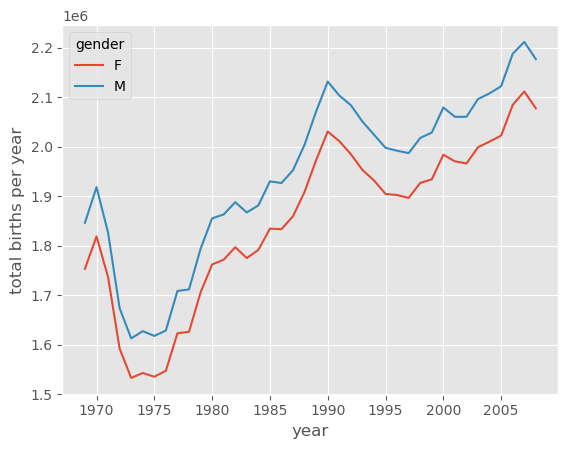
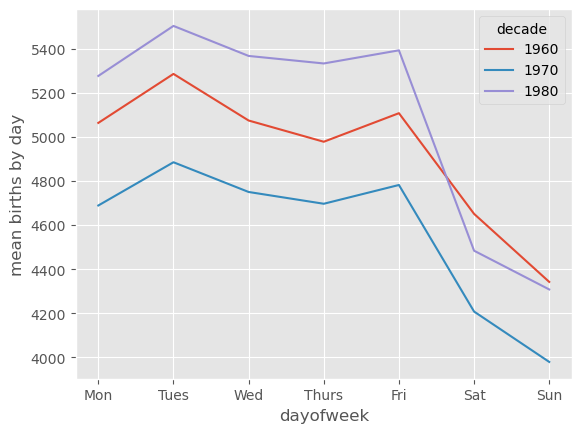
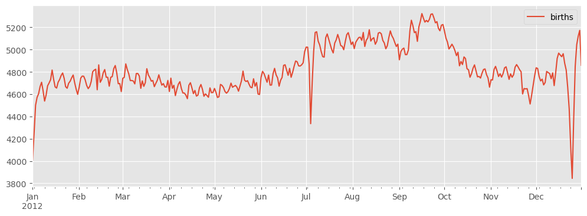

# Pivot Tables

## Titanic dataset


```python
import numpy as np 
import pandas as pd 
import seaborn as sns
titanic = sns.load_dataset('titanic')
titanic.head()
```


<div>
<style scoped>
    .dataframe tbody tr th:only-of-type {
        vertical-align: middle;
    }

    .dataframe tbody tr th {
        vertical-align: top;
    }

    .dataframe thead th {
        text-align: right;
    }
</style>
<table border="1" class="dataframe">
  <thead>
    <tr style="text-align: right;">
      <th></th>
      <th>survived</th>
      <th>pclass</th>
      <th>sex</th>
      <th>age</th>
      <th>sibsp</th>
      <th>parch</th>
      <th>fare</th>
      <th>embarked</th>
      <th>class</th>
      <th>who</th>
      <th>adult_male</th>
      <th>deck</th>
      <th>embark_town</th>
      <th>alive</th>
      <th>alone</th>
    </tr>
  </thead>
  <tbody>
    <tr>
      <th>0</th>
      <td>0</td>
      <td>3</td>
      <td>male</td>
      <td>22.0</td>
      <td>1</td>
      <td>0</td>
      <td>7.2500</td>
      <td>S</td>
      <td>Third</td>
      <td>man</td>
      <td>True</td>
      <td>NaN</td>
      <td>Southampton</td>
      <td>no</td>
      <td>False</td>
    </tr>
    <tr>
      <th>1</th>
      <td>1</td>
      <td>1</td>
      <td>female</td>
      <td>38.0</td>
      <td>1</td>
      <td>0</td>
      <td>71.2833</td>
      <td>C</td>
      <td>First</td>
      <td>woman</td>
      <td>False</td>
      <td>C</td>
      <td>Cherbourg</td>
      <td>yes</td>
      <td>False</td>
    </tr>
    <tr>
      <th>2</th>
      <td>1</td>
      <td>3</td>
      <td>female</td>
      <td>26.0</td>
      <td>0</td>
      <td>0</td>
      <td>7.9250</td>
      <td>S</td>
      <td>Third</td>
      <td>woman</td>
      <td>False</td>
      <td>NaN</td>
      <td>Southampton</td>
      <td>yes</td>
      <td>True</td>
    </tr>
    <tr>
      <th>3</th>
      <td>1</td>
      <td>1</td>
      <td>female</td>
      <td>35.0</td>
      <td>1</td>
      <td>0</td>
      <td>53.1000</td>
      <td>S</td>
      <td>First</td>
      <td>woman</td>
      <td>False</td>
      <td>C</td>
      <td>Southampton</td>
      <td>yes</td>
      <td>False</td>
    </tr>
    <tr>
      <th>4</th>
      <td>0</td>
      <td>3</td>
      <td>male</td>
      <td>35.0</td>
      <td>0</td>
      <td>0</td>
      <td>8.0500</td>
      <td>S</td>
      <td>Third</td>
      <td>man</td>
      <td>True</td>
      <td>NaN</td>
      <td>Southampton</td>
      <td>no</td>
      <td>True</td>
    </tr>
  </tbody>
</table>
</div>


```python
titanic.columns
```


    Index(['survived', 'pclass', 'sex', 'age', 'sibsp', 'parch', 'fare',
           'embarked', 'class', 'who', 'adult_male', 'deck', 'embark_town',
           'alive', 'alone'],
          dtype='object')


## Manually construct pivot table


```python
titanic.groupby('sex')[['survived']].mean()
```


<div>
<style scoped>
    .dataframe tbody tr th:only-of-type {
        vertical-align: middle;
    }

    .dataframe tbody tr th {
        vertical-align: top;
    }

    .dataframe thead th {
        text-align: right;
    }
</style>
<table border="1" class="dataframe">
  <thead>
    <tr style="text-align: right;">
      <th></th>
      <th>survived</th>
    </tr>
    <tr>
      <th>sex</th>
      <th></th>
    </tr>
  </thead>
  <tbody>
    <tr>
      <th>female</th>
      <td>0.742038</td>
    </tr>
    <tr>
      <th>male</th>
      <td>0.188908</td>
    </tr>
  </tbody>
</table>
</div>


```python
titanic.groupby(['sex', 'class'])['survived'].aggregate('mean').unstack()
```

    /tmp/ipykernel_119205/2603839867.py:1: FutureWarning: The default of observed=False is deprecated and will be changed to True in a future version of pandas. Pass observed=False to retain current behavior or observed=True to adopt the future default and silence this warning.
      titanic.groupby(['sex', 'class'])['survived'].aggregate('mean').unstack()


<div>
<style scoped>
    .dataframe tbody tr th:only-of-type {
        vertical-align: middle;
    }

    .dataframe tbody tr th {
        vertical-align: top;
    }

    .dataframe thead th {
        text-align: right;
    }
</style>
<table border="1" class="dataframe">
  <thead>
    <tr style="text-align: right;">
      <th>class</th>
      <th>First</th>
      <th>Second</th>
      <th>Third</th>
    </tr>
    <tr>
      <th>sex</th>
      <th></th>
      <th></th>
      <th></th>
    </tr>
  </thead>
  <tbody>
    <tr>
      <th>female</th>
      <td>0.968085</td>
      <td>0.921053</td>
      <td>0.500000</td>
    </tr>
    <tr>
      <th>male</th>
      <td>0.368852</td>
      <td>0.157407</td>
      <td>0.135447</td>
    </tr>
  </tbody>
</table>
</div>


```python
titanic.groupby(['sex', 'class'], observed=True)['survived'].aggregate('mean').unstack()
```


<div>
<style scoped>
    .dataframe tbody tr th:only-of-type {
        vertical-align: middle;
    }

    .dataframe tbody tr th {
        vertical-align: top;
    }

    .dataframe thead th {
        text-align: right;
    }
</style>
<table border="1" class="dataframe">
  <thead>
    <tr style="text-align: right;">
      <th>class</th>
      <th>First</th>
      <th>Second</th>
      <th>Third</th>
    </tr>
    <tr>
      <th>sex</th>
      <th></th>
      <th></th>
      <th></th>
    </tr>
  </thead>
  <tbody>
    <tr>
      <th>female</th>
      <td>0.968085</td>
      <td>0.921053</td>
      <td>0.500000</td>
    </tr>
    <tr>
      <th>male</th>
      <td>0.368852</td>
      <td>0.157407</td>
      <td>0.135447</td>
    </tr>
  </tbody>
</table>
</div>


## Pivot Table Syntax


```python
titanic.pivot_table('survived', index='sex', columns='class', aggfunc='mean')
```

    /tmp/ipykernel_119205/619644514.py:1: FutureWarning: The default value of observed=False is deprecated and will change to observed=True in a future version of pandas. Specify observed=False to silence this warning and retain the current behavior
      titanic.pivot_table('survived', index='sex', columns='class', aggfunc='mean')


<div>
<style scoped>
    .dataframe tbody tr th:only-of-type {
        vertical-align: middle;
    }

    .dataframe tbody tr th {
        vertical-align: top;
    }

    .dataframe thead th {
        text-align: right;
    }
</style>
<table border="1" class="dataframe">
  <thead>
    <tr style="text-align: right;">
      <th>class</th>
      <th>First</th>
      <th>Second</th>
      <th>Third</th>
    </tr>
    <tr>
      <th>sex</th>
      <th></th>
      <th></th>
      <th></th>
    </tr>
  </thead>
  <tbody>
    <tr>
      <th>female</th>
      <td>0.968085</td>
      <td>0.921053</td>
      <td>0.500000</td>
    </tr>
    <tr>
      <th>male</th>
      <td>0.368852</td>
      <td>0.157407</td>
      <td>0.135447</td>
    </tr>
  </tbody>
</table>
</div>


```python
titanic.pivot_table('survived', index='sex', columns='class', aggfunc='mean', observed=False)
```


<div>
<style scoped>
    .dataframe tbody tr th:only-of-type {
        vertical-align: middle;
    }

    .dataframe tbody tr th {
        vertical-align: top;
    }

    .dataframe thead th {
        text-align: right;
    }
</style>
<table border="1" class="dataframe">
  <thead>
    <tr style="text-align: right;">
      <th>class</th>
      <th>First</th>
      <th>Second</th>
      <th>Third</th>
    </tr>
    <tr>
      <th>sex</th>
      <th></th>
      <th></th>
      <th></th>
    </tr>
  </thead>
  <tbody>
    <tr>
      <th>female</th>
      <td>0.968085</td>
      <td>0.921053</td>
      <td>0.500000</td>
    </tr>
    <tr>
      <th>male</th>
      <td>0.368852</td>
      <td>0.157407</td>
      <td>0.135447</td>
    </tr>
  </tbody>
</table>
</div>


## Multilevel Pivot Tables


```python
age = pd.cut(titanic['age'], [0, 18, 80])
titanic.pivot_table('survived', ['sex', age], 'class', observed=False)
```


<div>
<style scoped>
    .dataframe tbody tr th:only-of-type {
        vertical-align: middle;
    }

    .dataframe tbody tr th {
        vertical-align: top;
    }

    .dataframe thead th {
        text-align: right;
    }
</style>
<table border="1" class="dataframe">
  <thead>
    <tr style="text-align: right;">
      <th></th>
      <th>class</th>
      <th>First</th>
      <th>Second</th>
      <th>Third</th>
    </tr>
    <tr>
      <th>sex</th>
      <th>age</th>
      <th></th>
      <th></th>
      <th></th>
    </tr>
  </thead>
  <tbody>
    <tr>
      <th rowspan="2" valign="top">female</th>
      <th>(0, 18]</th>
      <td>0.909091</td>
      <td>1.000000</td>
      <td>0.511628</td>
    </tr>
    <tr>
      <th>(18, 80]</th>
      <td>0.972973</td>
      <td>0.900000</td>
      <td>0.423729</td>
    </tr>
    <tr>
      <th rowspan="2" valign="top">male</th>
      <th>(0, 18]</th>
      <td>0.800000</td>
      <td>0.600000</td>
      <td>0.215686</td>
    </tr>
    <tr>
      <th>(18, 80]</th>
      <td>0.375000</td>
      <td>0.071429</td>
      <td>0.133663</td>
    </tr>
  </tbody>
</table>
</div>


```python
fare = pd.qcut(titanic['fare'], 2)
titanic.pivot_table('survived', ['sex', age], [fare, 'class'], observed=False)
```


<div>
<style scoped>
    .dataframe tbody tr th:only-of-type {
        vertical-align: middle;
    }

    .dataframe tbody tr th {
        vertical-align: top;
    }

    .dataframe thead tr th {
        text-align: left;
    }

    .dataframe thead tr:last-of-type th {
        text-align: right;
    }
</style>
<table border="1" class="dataframe">
  <thead>
    <tr>
      <th></th>
      <th>fare</th>
      <th colspan="3" halign="left">(-0.001, 14.454]</th>
      <th colspan="3" halign="left">(14.454, 512.329]</th>
    </tr>
    <tr>
      <th></th>
      <th>class</th>
      <th>First</th>
      <th>Second</th>
      <th>Third</th>
      <th>First</th>
      <th>Second</th>
      <th>Third</th>
    </tr>
    <tr>
      <th>sex</th>
      <th>age</th>
      <th></th>
      <th></th>
      <th></th>
      <th></th>
      <th></th>
      <th></th>
    </tr>
  </thead>
  <tbody>
    <tr>
      <th rowspan="2" valign="top">female</th>
      <th>(0, 18]</th>
      <td>NaN</td>
      <td>1.000000</td>
      <td>0.714286</td>
      <td>0.909091</td>
      <td>1.000000</td>
      <td>0.318182</td>
    </tr>
    <tr>
      <th>(18, 80]</th>
      <td>NaN</td>
      <td>0.880000</td>
      <td>0.444444</td>
      <td>0.972973</td>
      <td>0.914286</td>
      <td>0.391304</td>
    </tr>
    <tr>
      <th rowspan="2" valign="top">male</th>
      <th>(0, 18]</th>
      <td>NaN</td>
      <td>0.000000</td>
      <td>0.260870</td>
      <td>0.800000</td>
      <td>0.818182</td>
      <td>0.178571</td>
    </tr>
    <tr>
      <th>(18, 80]</th>
      <td>0.0</td>
      <td>0.098039</td>
      <td>0.125000</td>
      <td>0.391304</td>
      <td>0.030303</td>
      <td>0.192308</td>
    </tr>
  </tbody>
</table>
</div>


## aggfunc option


```python
titanic.pivot_table(index='sex', columns='class', 
                    aggfunc={'survived':sum, 'fare': 'mean'}, 
                    observed=False)
```

    /tmp/ipykernel_119205/3197013476.py:1: FutureWarning: The provided callable <built-in function sum> is currently using SeriesGroupBy.sum. In a future version of pandas, the provided callable will be used directly. To keep current behavior pass the string "sum" instead.
      titanic.pivot_table(index='sex', columns='class',


<div>
<style scoped>
    .dataframe tbody tr th:only-of-type {
        vertical-align: middle;
    }

    .dataframe tbody tr th {
        vertical-align: top;
    }

    .dataframe thead tr th {
        text-align: left;
    }

    .dataframe thead tr:last-of-type th {
        text-align: right;
    }
</style>
<table border="1" class="dataframe">
  <thead>
    <tr>
      <th></th>
      <th colspan="3" halign="left">fare</th>
      <th colspan="3" halign="left">survived</th>
    </tr>
    <tr>
      <th>class</th>
      <th>First</th>
      <th>Second</th>
      <th>Third</th>
      <th>First</th>
      <th>Second</th>
      <th>Third</th>
    </tr>
    <tr>
      <th>sex</th>
      <th></th>
      <th></th>
      <th></th>
      <th></th>
      <th></th>
      <th></th>
    </tr>
  </thead>
  <tbody>
    <tr>
      <th>female</th>
      <td>106.125798</td>
      <td>21.970121</td>
      <td>16.118810</td>
      <td>91</td>
      <td>70</td>
      <td>72</td>
    </tr>
    <tr>
      <th>male</th>
      <td>67.226127</td>
      <td>19.741782</td>
      <td>12.661633</td>
      <td>45</td>
      <td>17</td>
      <td>47</td>
    </tr>
  </tbody>
</table>
</div>


```python
titanic.pivot_table(index='sex', columns='class', 
                    aggfunc={'survived':'sum', 'fare': 'mean'}, 
                    observed=False)
```


<div>
<style scoped>
    .dataframe tbody tr th:only-of-type {
        vertical-align: middle;
    }

    .dataframe tbody tr th {
        vertical-align: top;
    }

    .dataframe thead tr th {
        text-align: left;
    }

    .dataframe thead tr:last-of-type th {
        text-align: right;
    }
</style>
<table border="1" class="dataframe">
  <thead>
    <tr>
      <th></th>
      <th colspan="3" halign="left">fare</th>
      <th colspan="3" halign="left">survived</th>
    </tr>
    <tr>
      <th>class</th>
      <th>First</th>
      <th>Second</th>
      <th>Third</th>
      <th>First</th>
      <th>Second</th>
      <th>Third</th>
    </tr>
    <tr>
      <th>sex</th>
      <th></th>
      <th></th>
      <th></th>
      <th></th>
      <th></th>
      <th></th>
    </tr>
  </thead>
  <tbody>
    <tr>
      <th>female</th>
      <td>106.125798</td>
      <td>21.970121</td>
      <td>16.118810</td>
      <td>91</td>
      <td>70</td>
      <td>72</td>
    </tr>
    <tr>
      <th>male</th>
      <td>67.226127</td>
      <td>19.741782</td>
      <td>12.661633</td>
      <td>45</td>
      <td>17</td>
      <td>47</td>
    </tr>
  </tbody>
</table>
</div>


## Add totals to columns and rows


```python
titanic.pivot_table('survived', index='sex', columns='class', 
                    margins=True,
                    observed=False)
```


<div>
<style scoped>
    .dataframe tbody tr th:only-of-type {
        vertical-align: middle;
    }

    .dataframe tbody tr th {
        vertical-align: top;
    }

    .dataframe thead th {
        text-align: right;
    }
</style>
<table border="1" class="dataframe">
  <thead>
    <tr style="text-align: right;">
      <th>class</th>
      <th>First</th>
      <th>Second</th>
      <th>Third</th>
      <th>All</th>
    </tr>
    <tr>
      <th>sex</th>
      <th></th>
      <th></th>
      <th></th>
      <th></th>
    </tr>
  </thead>
  <tbody>
    <tr>
      <th>female</th>
      <td>0.968085</td>
      <td>0.921053</td>
      <td>0.500000</td>
      <td>0.742038</td>
    </tr>
    <tr>
      <th>male</th>
      <td>0.368852</td>
      <td>0.157407</td>
      <td>0.135447</td>
      <td>0.188908</td>
    </tr>
    <tr>
      <th>All</th>
      <td>0.629630</td>
      <td>0.472826</td>
      <td>0.242363</td>
      <td>0.383838</td>
    </tr>
  </tbody>
</table>
</div>


# Example: Birthrate Data


```python
births = pd.read_csv("https://raw.githubusercontent.com/jakevdp/data-CDCbirths/master/births.csv")
births
```


<div>
<style scoped>
    .dataframe tbody tr th:only-of-type {
        vertical-align: middle;
    }

    .dataframe tbody tr th {
        vertical-align: top;
    }

    .dataframe thead th {
        text-align: right;
    }
</style>
<table border="1" class="dataframe">
  <thead>
    <tr style="text-align: right;">
      <th></th>
      <th>year</th>
      <th>month</th>
      <th>day</th>
      <th>gender</th>
      <th>births</th>
    </tr>
  </thead>
  <tbody>
    <tr>
      <th>0</th>
      <td>1969</td>
      <td>1</td>
      <td>1.0</td>
      <td>F</td>
      <td>4046</td>
    </tr>
    <tr>
      <th>1</th>
      <td>1969</td>
      <td>1</td>
      <td>1.0</td>
      <td>M</td>
      <td>4440</td>
    </tr>
    <tr>
      <th>2</th>
      <td>1969</td>
      <td>1</td>
      <td>2.0</td>
      <td>F</td>
      <td>4454</td>
    </tr>
    <tr>
      <th>3</th>
      <td>1969</td>
      <td>1</td>
      <td>2.0</td>
      <td>M</td>
      <td>4548</td>
    </tr>
    <tr>
      <th>4</th>
      <td>1969</td>
      <td>1</td>
      <td>3.0</td>
      <td>F</td>
      <td>4548</td>
    </tr>
    <tr>
      <th>...</th>
      <td>...</td>
      <td>...</td>
      <td>...</td>
      <td>...</td>
      <td>...</td>
    </tr>
    <tr>
      <th>15542</th>
      <td>2008</td>
      <td>10</td>
      <td>NaN</td>
      <td>M</td>
      <td>183219</td>
    </tr>
    <tr>
      <th>15543</th>
      <td>2008</td>
      <td>11</td>
      <td>NaN</td>
      <td>F</td>
      <td>158939</td>
    </tr>
    <tr>
      <th>15544</th>
      <td>2008</td>
      <td>11</td>
      <td>NaN</td>
      <td>M</td>
      <td>165468</td>
    </tr>
    <tr>
      <th>15545</th>
      <td>2008</td>
      <td>12</td>
      <td>NaN</td>
      <td>F</td>
      <td>173215</td>
    </tr>
    <tr>
      <th>15546</th>
      <td>2008</td>
      <td>12</td>
      <td>NaN</td>
      <td>M</td>
      <td>181235</td>
    </tr>
  </tbody>
</table>
<p>15547 rows × 5 columns</p>
</div>


```python
births['decade'] = 10 * (births['year'] // 10) 
births.pivot_table('births', index='decade', columns='gender', 
                   aggfunc='sum', observed=False)
```


<div>
<style scoped>
    .dataframe tbody tr th:only-of-type {
        vertical-align: middle;
    }

    .dataframe tbody tr th {
        vertical-align: top;
    }

    .dataframe thead th {
        text-align: right;
    }
</style>
<table border="1" class="dataframe">
  <thead>
    <tr style="text-align: right;">
      <th>gender</th>
      <th>F</th>
      <th>M</th>
    </tr>
    <tr>
      <th>decade</th>
      <th></th>
      <th></th>
    </tr>
  </thead>
  <tbody>
    <tr>
      <th>1960</th>
      <td>1753634</td>
      <td>1846572</td>
    </tr>
    <tr>
      <th>1970</th>
      <td>16263075</td>
      <td>17121550</td>
    </tr>
    <tr>
      <th>1980</th>
      <td>18310351</td>
      <td>19243452</td>
    </tr>
    <tr>
      <th>1990</th>
      <td>19479454</td>
      <td>20420553</td>
    </tr>
    <tr>
      <th>2000</th>
      <td>18229309</td>
      <td>19106428</td>
    </tr>
  </tbody>
</table>
</div>


```python
%matplotlib inline
import matplotlib.pyplot as plt 
plt.style.use('ggplot')
births.pivot_table(
    'births', index='year', columns='gender', aggfunc='sum'
).plot()
plt.ylabel('total births per year');
```


    

    


## Other stuff

## Removing outliers with _sigma clipping_


```python
quartiles = np.percentile(births['births'], [25, 50, 75])
mu = quartiles[1]
sig = 0.74 * (quartiles[2] - quartiles[1])
```


```python
births = births.query('(births > @mu - 5 * @sig) & (births < @mu + 5 * @sig)')
```

Next we set the day column to integers; previously it had been a string column because some columns in the dataset contained the value 'null':


```python
births.loc[:,'day'] = births['day'].astype(int)
```


```python
births.index = pd.to_datetime(10000 * births.year + 
                             100 * births.month + 
                             births.day, format='%Y%m%d')
births.loc[:,'dayofweek'] = births.index.dayofweek
```


```python
import matplotlib.pyplot as plt 
import matplotlib as mpl 

births.pivot_table('births', index='dayofweek', columns='decade', 
                  aggfunc='mean', observed=False).plot()
plt.gca().set(xticks=range(7), 
             xticklabels=['Mon', 'Tues', 'Wed', 'Thurs', 'Fri', 'Sat', 'Sun'])
plt.ylabel('mean births by day')
```


    Text(0, 0.5, 'mean births by day')


    

    


```python
births_by_date = births.pivot_table('births', 
                                   [births.index.month, births.index.day])
births_by_date.head()
```


<div>
<style scoped>
    .dataframe tbody tr th:only-of-type {
        vertical-align: middle;
    }

    .dataframe tbody tr th {
        vertical-align: top;
    }

    .dataframe thead th {
        text-align: right;
    }
</style>
<table border="1" class="dataframe">
  <thead>
    <tr style="text-align: right;">
      <th></th>
      <th></th>
      <th>births</th>
    </tr>
  </thead>
  <tbody>
    <tr>
      <th rowspan="5" valign="top">1</th>
      <th>1</th>
      <td>4009.225</td>
    </tr>
    <tr>
      <th>2</th>
      <td>4247.400</td>
    </tr>
    <tr>
      <th>3</th>
      <td>4500.900</td>
    </tr>
    <tr>
      <th>4</th>
      <td>4571.350</td>
    </tr>
    <tr>
      <th>5</th>
      <td>4603.625</td>
    </tr>
  </tbody>
</table>
</div>


```python
from datetime import datetime
```


```python
births_by_date.index = [datetime(2012, month, day) 
                        for (month, day) in births_by_date.index]
births_by_date.head()
```


<div>
<style scoped>
    .dataframe tbody tr th:only-of-type {
        vertical-align: middle;
    }

    .dataframe tbody tr th {
        vertical-align: top;
    }

    .dataframe thead th {
        text-align: right;
    }
</style>
<table border="1" class="dataframe">
  <thead>
    <tr style="text-align: right;">
      <th></th>
      <th>births</th>
    </tr>
  </thead>
  <tbody>
    <tr>
      <th>2012-01-01</th>
      <td>4009.225</td>
    </tr>
    <tr>
      <th>2012-01-02</th>
      <td>4247.400</td>
    </tr>
    <tr>
      <th>2012-01-03</th>
      <td>4500.900</td>
    </tr>
    <tr>
      <th>2012-01-04</th>
      <td>4571.350</td>
    </tr>
    <tr>
      <th>2012-01-05</th>
      <td>4603.625</td>
    </tr>
  </tbody>
</table>
</div>


```python
fig, ax = plt.subplots(figsize=(12,4))
births_by_date.plot(ax=ax);
```


    

    


```python

```
